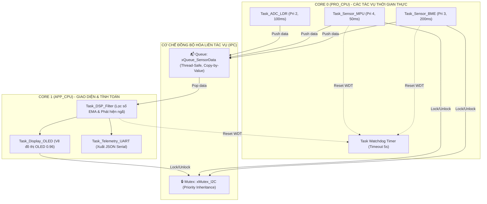

# ⚡ HUB CẢM BIẾN ĐA TÁC VỤ SỬ DỤNG FREERTOS & ESP-IDF
## High-Performance Dual-Core FreeRTOS Sensor Hub with Inter-Task Communication and Watchdog

[](https://github.com/NguyenHoangUy1305/esp32-freertos-sensor-hub/actions/workflows/ci.yml)
[](https://github.com/NguyenHoangUy1305/esp32-freertos-sensor-hub)
[](LICENSE)

> **Tên đề tài:** Xây dựng trạm thu thập dữ liệu đa cảm biến thời gian thực ứng dụng hệ điều hành FreeRTOS và kiến trúc đa nhân trên vi điều khiển ESP32  
> **Tác giả:** Kỹ sư IoT & Hệ thống nhúng (NguyenHoangUy1305)  
> **Thời gian:** Tháng 04/2027 - Tháng 05/2027  
> **Trọng tâm:** Chuyển dịch từ Arduino cơ bản sang **ESP-IDF** chuyên nghiệp, làm chủ lập trình đa nhân vi điều khiển, các cơ chế đồng bộ IPC (Queue, Mutex, Semaphore, EventGroup) và Task Watchdog Timer.

---

> 📘 **TÀI LIỆU KỸ THUẬT & LÝ THUYẾT ĐẦY ĐỦ:** Xem chi tiết toàn bộ lý thuyết FreeRTOS, hiện tượng Priority Inversion, bộ lọc EMA và sơ đồ nối dây tại [`docs/SO_DO_KY_THUAT_VA_LY_THUYET.md`](./docs/SO_DO_KY_THUAT_VA_LY_THUYET.md).

---

## 1. SƠ ĐỒ KIẾN TRÚC ĐA NHÂN & TƯƠNG TÁC IPC TRONG FREERTOS



---

## 2. BẢNG ĐẤU NỐI CHÂN PHẦN CỨNG (PINOUT)

| Cảm biến / Linh kiện | Chân Module | Chân kết nối ESP32 | Loại tín hiệu | Vai trò kỹ thuật trong FreeRTOS |
| :--- | :--- | :--- | :--- | :--- |
| **Cảm biến BME280** | **VCC / GND** | **3V3 / GND** | 3.3V DC | Cảm biến nhiệt độ, độ ẩm, áp suất |
| | **SCL / SDA** | **GPIO 22 / 21**| $I^2C$ Bus (Kéo $4.7\text{k}\Omega$) | Bảo vệ qua `xMutex_I2C` (Addr: `0x76`) |
| **Cảm biến MPU6050** | **VCC / GND** | **3V3 / GND** | 3.3V DC | Cảm biến gia tốc & con quay 6 trục |
| | **SCL / SDA** | **GPIO 22 / 21**| $I^2C$ Bus (Dùng chung) | Bảo vệ qua `xMutex_I2C` (Addr: `0x68`) |
| **Màn hình OLED 0.96**| **VCC / GND** | **3V3 / GND** | 3.3V DC | Hiển thị giao diện đồ họa |
| | **SCL / SDA** | **GPIO 22 / 21**| $I^2C$ Bus (Dùng chung) | Bảo vệ qua `xMutex_I2C` (Addr: `0x3C`) |
| **Quang trở LDR** | **VOUT** | **GPIO 34** | ADC1_CH6 (Analog) | Đo cường độ ánh sáng môi trường |
| **LED Heartbeat** | **Anode (+)** | **GPIO 2** | 3.3V qua $220\Omega$ | Nhịp đập CPU Core 0 định kỳ |

---

## 3. CÁC TÍNH NĂNG KỸ THUẬT TIÊU BIỂU
1. **Phân bổ đa nhân thực thụ:** Gán các tác vụ đo lường vào Core 0 và tác vụ tính toán/giao diện vào Core 1 bằng `xTaskCreatePinnedToCore()`.
2. **Loại bỏ hoàn toàn Race Condition & Priority Inversion:** Áp dụng `xSemaphoreCreateMutex()` với cơ chế kế thừa độ ưu tiên (Priority Inheritance).
3. **Giám sát độ tin cậy bằng Task Watchdog Timer (TWDT):** Tự động phát hiện Deadlock hoặc vòng lặp vô tận và khởi động lại vi điều khiển trong $< 5\text{ giây}$.
4. **Bộ lọc trung bình động lũy thừa (EMA):** Thuật toán số học làm mượt tín hiệu đo đạc với footprint bộ nhớ chỉ $4\text{ bytes}$ RAM.

---

## 4. HƯỚNG DẪN BIÊN DỊCH VỚI ESP-IDF
```bash
# Thiết lập môi trường ESP-IDF (phiên bản v5.x khuyến nghị)
. $HOME/esp/esp-idf/export.sh

# Cấu hình dự án (Tùy chỉnh tick rate, stack size)
idf.py menuconfig

# Biên dịch và nạp firmware qua cổng COM
idf.py build
idf.py -p COM3 flash monitor
```
