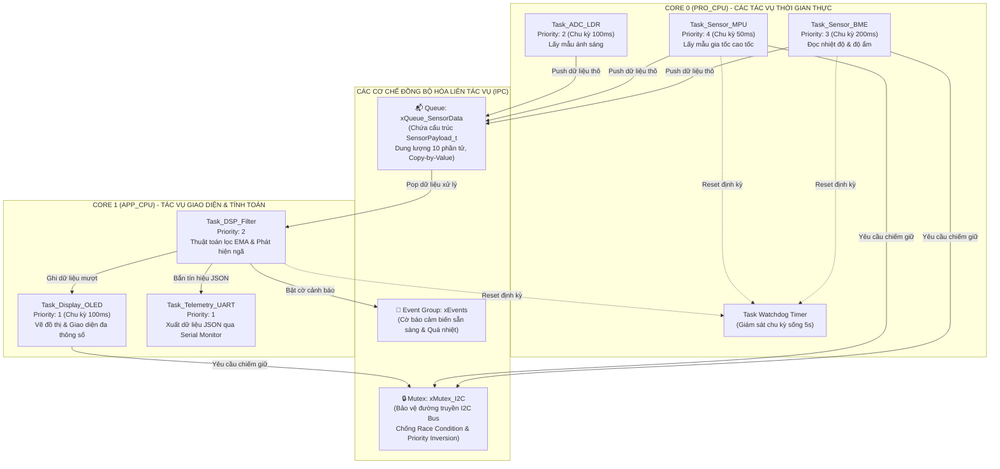
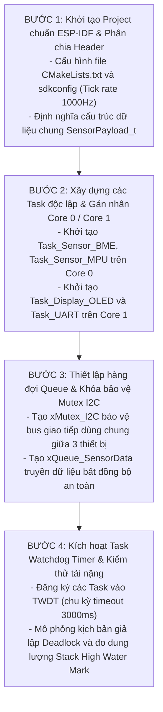
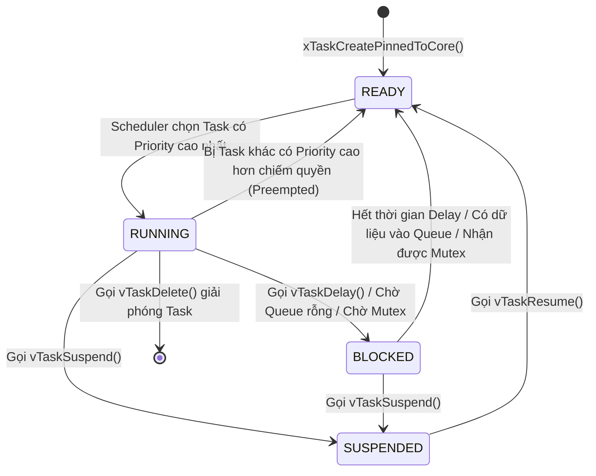
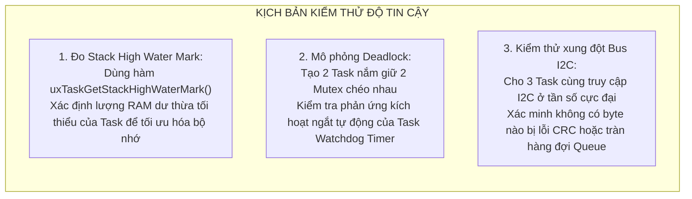

# 📘 SỔ TAY KỸ THUẬT CHUYÊN SÂU: SƠ ĐỒ KỸ THUẬT, SƠ ĐỒ QUY TRÌNH & CƠ SỞ LÝ THUYẾT
## Đề tài: Hub cảm biến đa tác vụ sử dụng FreeRTOS & ESP-IDF (Multi-tasking Sensor Hub)

> **Tác giả:** Kỹ sư IoT & Hệ thống nhúng (NguyenHoangUy1305)  
> **Repository:** [NguyenHoangUy1305/esp32-freertos-sensor-hub](https://github.com/NguyenHoangUy1305/esp32-freertos-sensor-hub)  
> **Thời gian thực hiện:** Tháng 04/2027 - Tháng 05/2027  
> **Mục đích:** Cung cấp tài liệu kỹ thuật chuyên sâu về lập trình hệ thống thời gian thực (RTOS), kiến trúc vi xử lý đa nhân Dual-Core Xtensa, các cơ chế truyền thông liên tác vụ (IPC: Queue, Mutex, Priority Inheritance, EventGroup), cơ chế giám sát Task Watchdog Timer và thuật toán lọc số tín hiệu cảm biến.

---

## MỤC LỤC
1. [PHẦN 1: CƠ SỞ LÝ THUYẾT & NGUYÊN LÝ HOẠT ĐỘNG CHUYÊN SÂU](#phần-1-cơ-sở-lý-thuyết--nguyên-lý-hoạt-động-chuyên-sâu)
   - 1.1 Khái niệm Hệ điều hành thời gian thực (RTOS) & Tính tất định (Determinism)
   - 1.2 Hạn chế của Arduino Super-Loop & Giải pháp RTOS Preemptive Scheduling
   - 1.3 Bộ điều phối Scheduler, SysTick Timer & Phân biệt vTaskDelay vs vTaskDelayUntil
   - 1.4 Kiến trúc Dual-Core Xtensa LX6 & Chiến lược gán nhân vi xử lý
   - 1.5 Các cơ chế truyền thông và đồng bộ hóa liên tác vụ (IPC):
     - FreeRTOS Queue (Hàng đợi an toàn tuyến trình)
     - Mutex & Hiện tượng Hiểm họa Nghịch đảo độ ưu tiên (Priority Inversion)
     - Binary Semaphore, Counting Semaphore & Task Notifications
     - Event Groups (Đồng bộ hóa đa điều kiện)
   - 1.6 Cơ chế giám sát độ tin cậy Task Watchdog Timer (TWDT)
   - 1.7 Thuật toán lọc tín hiệu số cảm biến (DSP: Exponential Moving Average)
2. [PHẦN 2: SƠ ĐỒ KỸ THUẬT & SƠ ĐỒ ĐẤU NỐI MẠCH (PINOUT)](#phần-2-sơ-đồ-kỹ-thuật--sơ-đồ-đấu-nối-mạch-pinout)
   - 2.1 Bảng ánh xạ chân GPIO chi tiết (Hardware Pinout Matrix)
   - 2.2 Sơ đồ nguyên lý mạch điện phần cứng đa cảm biến
   - 2.3 Sơ đồ kiến trúc tương tác liên tác vụ IPC trong FreeRTOS
3. [PHẦN 3: SƠ ĐỒ LÀM & SƠ ĐỒ QUY TRÌNH THỰC HIỆN DỰ ÁN](#phần-3-sơ-đồ-làm--sơ-đồ-quy-trình-thực-hiện-dự-án)
   - 3.1 Quy trình 4 bước phát triển dự án chuẩn ESP-IDF
   - 3.2 Sơ đồ vòng đời và các trạng thái của một Task (Task State Diagram)
   - 3.3 Sơ đồ kiểm thử tải nặng, đo lường bộ nhớ Stack & Mô phỏng Deadlock

---

# PHẦN 1: CƠ SỞ LÝ THUYẾT & NGUYÊN LÝ HOẠT ĐỘNG CHUYÊN SÂU

### 1.1. Khái niệm Hệ điều hành thời gian thực (RTOS) & Tính tất định (Determinism)
* **Khác biệt cốt lõi giữa GPOS (Windows, Linux, macOS) và RTOS (FreeRTOS):**
  - **GPOS:** Được tối ưu hóa cho **thông lượng tổng thể (Throughput)** và trải nghiệm đa nhiệm của người dùng. Hệ thống có thể bị khựng lại vài chục mili-giây khi có tiến trình nặng chạy nền mà không gây hậu quả nghiêm trọng.
  - **RTOS:** Được thiết kế tối ưu cho **tính tất định (Determinism)** và **độ trễ phản hồi cực thấp (Guaranteed Response Time)**. Trong RTOS, một phép tính hoặc một tác vụ bắt buộc phải hoàn thành trước một thời hạn xác định (**Deadline**).
* **Phân loại RTOS:**
  - **Hard Real-Time:** Nếu trễ hạn chót (Deadline), toàn bộ hệ thống bị coi là thất bại và có thể gây thảm họa (ví dụ: bung túi khí ô tô, điều khiển thanh nhiên liệu hạt nhân).
  - **Soft Real-Time:** Trễ hạn chót làm giảm chất lượng hệ thống nhưng không làm hỏng hóc nghiêm trọng (ví dụ: rớt vài khung hình trên màn hình OLED hoặc trễ hiển thị đo đạc nhiệt độ).

---

### 1.2. Hạn chế của Arduino Super-Loop & Giải pháp RTOS Preemptive Scheduling
* **Hạn chế chết người của kiến trúc `loop()` truyền thống:**
  - Lệnh `delay(1000)` làm CPU bị treo cứng vào các vòng lặp vô nghĩa (Nop) để chờ thời gian trôi qua.
  - Trong lúc CPU đang bị "bắt cóc" bởi `delay()`, vi điều khiển không thể phát hiện nút nhấn khẩn cấp, không thể đón nhận gói tin mạng, dẫn đến tình trạng mất kiểm soát hệ thống.
* **Bộ điều phối chiếm quyền ưu tiên (Preemptive Priority-Based Scheduler):**
  - Scheduler của FreeRTOS được điều khiển bởi một ngắt đồng hồ nhịp tim phần cứng (**SysTick Timer**, cấu hình `configTICK_RATE_HZ = 1000` tức là $1	ext{ ms}$ mỗi tick).
  - Mỗi Task được gán một mức độ ưu tiên (**Priority**, từ 0 đến `configMAX_PRIORITIES - 1`).
  - **Quy tắc bất biến:** Task có Priority cao nhất đang ở trạng thái `READY` sẽ **ngay lập tức chiếm CPU** để thực thi.
  - Khi một Task gọi hàm `vTaskDelay(pdMS_TO_TICKS(100))` hoặc `vTaskDelayUntil()`, nó không chiếm CPU mà tự chuyển mình sang trạng thái `BLOCKED`, nhường trọn vẹn tài nguyên CPU cho các Task khác làm việc!

---

### 1.3. Bộ điều phối Scheduler, SysTick Timer & Phân biệt vTaskDelay vs vTaskDelayUntil
* **Hiện tượng trôi thời gian tích lũy (Cumulative Drift) khi dùng `vTaskDelay`:**
  - Giả sử bạn muốn đọc cảm biến mỗi $100	ext{ ms}$. Hàm xử lý đọc cảm biến tốn $15	ext{ ms}$.
  - Nếu bạn dùng `vTaskDelay(100)`: Sau khi code chạy xong ($15	ext{ ms}$), CPU mới bắt đầu đếm lùi $100	ext{ ms}$.
  - Tổng chu kỳ thực tế sẽ là:
    $$T_{	ext{actual}} = T_{	ext{execution}} + T_{	ext{delay}} = 15	ext{ ms} + 100	ext{ ms} = 115	ext{ ms}!$$
  - Cứ sau 10 chu kỳ, thời gian lấy mẫu đã bị trôi đi $150	ext{ ms}$, làm sai lệch hoàn toàn tần số lấy mẫu của các bộ lọc số DSP.
* **Giải pháp chuẩn xác với `vTaskDelayUntil`:**
  - Hàm lưu trữ biến mốc thời gian đánh thức tuyệt đối `xLastWakeTime`.
  - Hàm tự động tính toán và bù trừ thời gian thực thi của code:
    $$T_{	ext{sleep}} = 	ext{Period} - T_{	ext{execution}} = 100	ext{ ms} - 15	ext{ ms} = 85	ext{ ms}$$
  - Đảm bảo chu kỳ tuần hoàn lặp lại luôn chính xác tuyệt đối đúng $100.0	ext{ ms}$ từng mili-giây!

---

### 1.4. Kiến trúc Dual-Core Xtensa LX6 & Chiến lược gán nhân vi xử lý
Vi điều khiển ESP32 tích hợp hai nhân xử lý 32-bit độc lập:
* **Core 0 (PRO_CPU - Protocol CPU):** Mặc định được hệ thống FreeRTOS của Espressif phân bổ để xử lý các tầng giao thức ngắt mạng nặng (Wi-Fi, Bluetooth, TCP/IP stack).
* **Core 1 (APP_CPU - Application CPU):** Mặc định dành cho mã logic ứng dụng người dùng.
* **Chiến lược gán nhân bằng hàm `xTaskCreatePinnedToCore()`:**
  - **Gán vào Core 0:** Task đo đạc cảm biến thời gian thực cao tốc và các bộ lọc số yêu cầu chu kỳ lấy mẫu chính xác từng mili-giây.
  - **Gán vào Core 1:** Task vẽ giao diện đồ họa OLED nặng nề, Task tính toán logic nghiệp vụ và Task truyền thông nối tiếp UART/Serial.
  - Nhờ đó, việc màn hình OLED vẽ đồ thị tốn $50	ext{ ms}$ cũng **không bao giờ làm ảnh hưởng hay gây trễ** đến chu kỳ đọc cảm biến của Core 0!

---

### 1.5. Các cơ chế truyền thông và đồng bộ hóa liên tác vụ (IPC)

#### A. FreeRTOS Queue (Hàng đợi an toàn tuyến trình)
* Queue là cơ chế giao tiếp chính giữa các Task trong FreeRTOS.
* **Đặc tính kỹ thuật:**
  - **Copy by Value:** Dữ liệu đẩy vào Queue được sao chép nguyên vẹn từng byte vào bộ đệm của Queue, tránh hoàn toàn nguy cơ con trỏ bị Task khác sửa đổi vùng nhớ khi đang truyền.
  - **Thread-Safe & FIFO:** Tích hợp sẵn cơ chế khóa ngắt, đảm bảo nhiều Task cùng đẩy dữ liệu vào một Queue mà không bị xung đột (Race Condition).
  - **Cơ chế Block on Read/Write:** Khi Queue rỗng, Task đọc sẽ tự động chuyển sang trạng thái `BLOCKED` chờ tới khi có dữ liệu hoặc hết thời gian timeout `portMAX_DELAY`, hoàn toàn không tiêu tốn $0.001\%$ CPU!

#### B. Mutex & Hiện tượng Hiểm họa Nghịch đảo độ ưu tiên (Priority Inversion)
* **Mutex (Mutual Exclusion):** Dùng để bảo vệ tài nguyên dùng chung duy nhất (ví dụ: chỉ có 1 cổng phần cứng bus $I^2C$ hoặc 1 cổng UART Serial) khi có nhiều Task cùng tranh giành quyền truy cập.
* **Thảm họa Nghịch đảo độ ưu tiên (Priority Inversion Problem):**
  - Giả sử có 3 Task: `Task_High` (ưu tiên cao), `Task_Medium` (ưu tiên trung bình), `Task_Low` (ưu tiên thấp).
  - `Task_Low` đang chạy và chiếm giữ Mutex của cổng $I^2C$.
  - `Task_High` sẵn sàng chạy, yêu cầu lấy Mutex $I^2C$ nhưng bị chặn lại (chuyển sang `BLOCKED` chờ `Task_Low` nhả).
  - Lúc này, `Task_Medium` xuất hiện. Vì Priority của `Task_Medium` cao hơn `Task_Low`, nên `Task_Medium` chiếm CPU chạy miệt mài!
  - **Hậu quả:** `Task_High` (ưu tiên cao nhất) bị kẹt cứng vô thời hạn chờ `Task_Medium` (ưu tiên trung bình) chạy xong! Đây chính là lỗi kinh điển từng làm tê liệt robot tự hành Mars Pathfinder của NASA năm 1997.
* **Giải pháp Kế thừa độ ưu tiên (Priority Inheritance) trong FreeRTOS Mutex:**
  Khi `Task_High` bị kẹt chờ Mutex từ `Task_Low`, FreeRTOS sẽ **tự động nâng tạm thời mức ưu tiên của `Task_Low` lên bằng `Task_High`**. Nhờ đó, `Task_Low` không bị `Task_Medium` chen ngang, nhanh chóng hoàn thành việc và giải phóng Mutex trả lại cho `Task_High`!

#### C. Binary Semaphore, Counting Semaphore & Task Notifications
* **Binary Semaphore:** Hoạt động như một cờ báo hiệu nhị phân (0 hoặc 1), thường dùng để báo hiệu sự kiện từ ngắt phần cứng (ISR) ra ngoài một Task nền (`xSemaphoreGiveFromISR`).
* **Counting Semaphore:** Quản lý số lượng tài nguyên hữu hạn (ví dụ: một hồ chứa có tối đa 5 vị trí đệm).
* **Task Notifications:** Cơ chế truyền tin trực tiếp siêu nhẹ tích hợp sẵn vào khối điều khiển tác vụ (Task Control Block - TCB). Nhanh hơn Semaphore tới $45\%$ và không tốn thêm byte RAM nào để cấp phát đối tượng Semaphore riêng biệt.

#### D. Event Groups (Đồng bộ hóa đa điều kiện)
Cho phép một Task chuyển sang trạng thái chờ đồng thời nhiều cờ sự kiện khác nhau bằng hàm `xEventGroupWaitBits()`. Ví dụ: Task điều khiển chỉ được phép kích hoạt máy bơm khi cả 3 điều kiện cùng thỏa mãn:
`BIT_SENSOR_READY & BIT_WATER_LEVEL_HIGH & BIT_DOOR_CLOSED`.

---

### 1.6. Cơ chế giám sát độ tin cậy Task Watchdog Timer (TWDT)
* Trong hệ thống nhúng hoạt động 24/7, một lỗi logic nhỏ có thể dẫn đến **Deadlock** (hai Task chờ Mutex chéo nhau) hoặc rơi vào vòng lặp vô tận (Infinite Loop).
* **Cơ chế Watchdog trong ESP-IDF:**
  - ESP-IDF tích hợp bộ định thời phần cứng **Task Watchdog Timer (TWDT)** với chu kỳ cấu hình (ví dụ: 5 giây).
  - Mỗi Task quan trọng bắt buộc phải đăng ký theo dõi vào TWDT bằng hàm `esp_task_wdt_add()`.
  - Định kỳ trong mỗi vòng lặp, Task phải gọi lệnh `esp_task_wdt_reset()` để xác nhận mình vẫn đang sống bình thường.
  - Nếu vì bất kỳ lý do gì mà một Task không kịp gọi lệnh reset trong vòng 5 giây: TWDT lập tức kích hoạt ngắt, dump toàn bộ thanh ghi và Call Stack qua UART để kỹ sư debug, đồng thời thực hiện **Hardware Reset** để khởi động lại vi điều khiển ngay lập tức!

---

### 1.7. Thuật toán lọc tín hiệu số cảm biến (DSP: Exponential Moving Average)
Các cảm biến vật lý (nhiệt độ, ánh sáng, gia tốc) luôn có nhiễu đột biến ngẫu nhiên (Noise spikes).
* **Bộ lọc trung bình động thông thường (Simple Moving Average - SMA):** Đòi hỏi phải lưu một mảng $N$ phần tử trong RAM và tính tổng, tốn bộ nhớ và thời gian tính toán.
* **Bộ lọc trung bình động lũy thừa (Exponential Moving Average - EMA):**
  $$S_t = lpha \cdot Y_t + (1 - lpha) \cdot S_{t-1}$$
  - $Y_t$: Giá trị đo thô mới nhất từ cảm biến tại thời điểm $t$.
  - $S_{t-1}$: Giá trị đã qua lọc ở chu kỳ trước.
  - $S_t$: Giá trị sau khi lọc ở chu kỳ hiện tại.
  - $lpha$: Hệ số làm mịn ($0 < lpha \le 1$). Nếu $lpha$ nhỏ (ví dụ $0.1$), tín hiệu mượt mà, triệt nhiễu cực tốt. Nếu $lpha$ lớn (ví dụ $0.8$), hệ thống phản hồi cực nhanh với sự thay đổi thực tế.
  - Thuật toán chỉ tốn đúng **4 bytes RAM** để lưu giá trị $S_{t-1}$ và chỉ mất 2 phép tính số học, hoàn hảo cho hệ thống thời gian thực!

---

# PHẦN 2: SƠ ĐỒ KỸ THUẬT & SƠ ĐỒ ĐẤU NỐI MẠCH (PINOUT)

### 2.1. Bảng ánh xạ chân GPIO chi tiết (Hardware Pinout Matrix)

| Cảm biến / Linh kiện | Chân Module | Chân kết nối ESP32 | Loại tín hiệu | Vai trò kỹ thuật trong FreeRTOS |
| :--- | :--- | :--- | :--- | :--- |
| **Cảm biến BME280** | **VCC** | **3V3** | 3.3V DC | Cấp nguồn ổn định cho cảm biến |
| | **GND** | **GND** | 0V | Mass chung |
| | **SCL** | **GPIO 22** | $I^2C$ Clock | Được bảo vệ bằng `xMutex_I2C` |
| | **SDA** | **GPIO 21** | $I^2C$ Data | Được bảo vệ bằng `xMutex_I2C` |
| **Cảm biến MPU6050** | **VCC** | **3V3** | 3.3V DC | Cảm biến gia tốc & con quay hồi chuyển 6 trục |
| | **GND** | **GND** | 0V | Mass chung |
| | **SCL** | **GPIO 22** | $I^2C$ Clock (Chung bus)| Chia sẻ bus $I^2C$ qua Mutex (Addr: `0x68`) |
| | **SDA** | **GPIO 21** | $I^2C$ Data (Chung bus) | Chia sẻ bus $I^2C$ qua Mutex (Addr: `0x68`) |
| **Quang trở LDR** | **VCC** | **3V3** | 3.3V DC | Cầu phân áp đo cường độ ánh sáng |
| | **VOUT** | **GPIO 34 (ADC1_CH6)**| Analog Input | Đo điện áp ADC 12-bit (Kênh ngắt ADC) |
| **Màn hình OLED 0.96**| **VCC** | **3V3** | 3.3V DC | Hiển thị thông số đa tác vụ |
| | **SCL** | **GPIO 22** | $I^2C$ Clock (Chung bus)| Hiển thị thông số (Task chạy trên Core 1) |
| | **SDA** | **GPIO 21** | $I^2C$ Data (Chung bus) | Hiển thị thông số (Task chạy trên Core 1) |
| **LED Trạng Thái Core**| **Anode (+)** | **GPIO 2** | 3.3V qua $220\Omega$ | Nhấp nháy theo nhịp Heartbeat của Core 0 |

---

### 2.2. Sơ đồ nguyên lý mạch điện phần cứng đa cảm biến

```text
       +-------------------------------------------------------------+
       |             SƠ ĐỒ MẠCH HUB ĐA CẢM BIẾN DÙNG CHUNG I2C        |
       +-------------------------------------------------------------+

                                      +3.3V
                                        │
                         ┌──────────────┴─────────────┐
                         │ [4.7kΩ]           [4.7kΩ]  │ (Điện trở kéo lên)
                         │   │                 │      │
                         │   │   GPIO 22 (SCL) ├───┬──(SCL) BME280 (Addr: 0x76)
                         │   └───GPIO 21 (SDA) ┼─┬─│──(SDA)
                         │                     │ │ │
                         │                     │ ├───(SCL) MPU6050 (Addr: 0x68)
                         │                     │ └───(SDA)
                         │                     │
                         │                     ├───(SCL) OLED 0.96 (Addr: 0x3C)
                         │                     └───(SDA)
                         │
     +3.3V               │   +-------------------------+
       │                 │   |    ESP32 DEVKIT V1      |
       ├─[LDR 光]        │   |                         |
       │    │            └──>| 3V3             GPIO 22 |────> I2C SCL Bus
       │    ├──(VOUT)───────>| GPIO 34 (ADC)   GPIO 21 |────> I2C SDA Bus
       │    │                |                         |
       │  [10kΩ]             | GPIO 2                  |────>[220Ω]──>(+) LED HEARTBEAT
       │    │                |                         |
     (GND)──┴────────────────| GND                 GND |────> Mass chung
                             +-------------------------+
```

---

### 2.3. Sơ đồ kiến trúc tương tác liên tác vụ IPC trong FreeRTOS



---

# PHẦN 3: SƠ ĐỒ LÀM & SƠ ĐỒ QUY TRÌNH THỰC HIỆN DỰ ÁN

### 3.1. Quy trình 4 bước phát triển dự án chuẩn ESP-IDF



---

### 3.2. Sơ đồ vòng đời và các trạng thái của một Task (Task State Diagram)



---

### 3.3. Sơ đồ kiểm thử tải nặng, đo lường bộ nhớ Stack & Mô phỏng Deadlock


